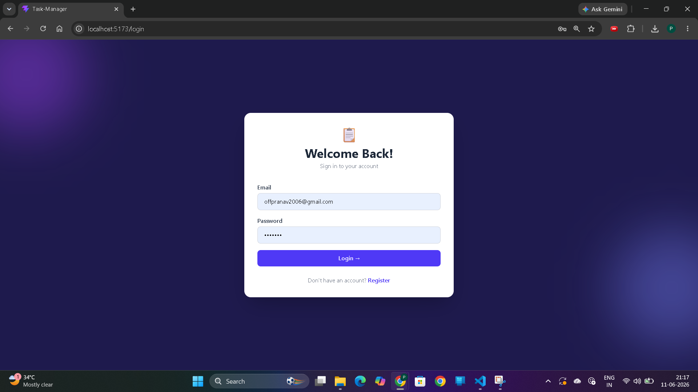
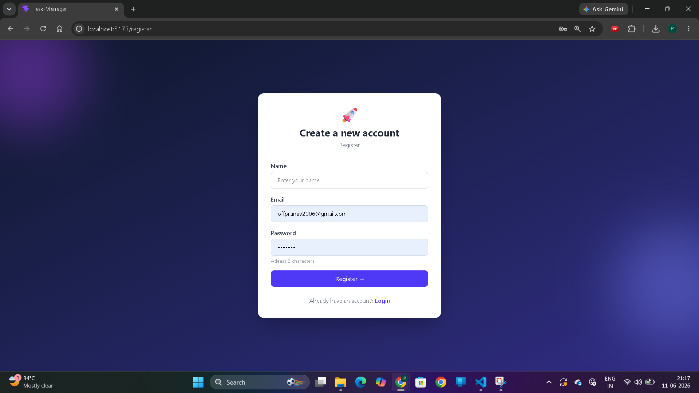
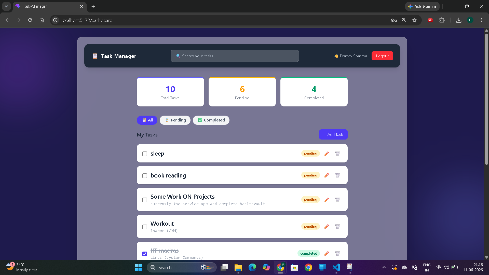
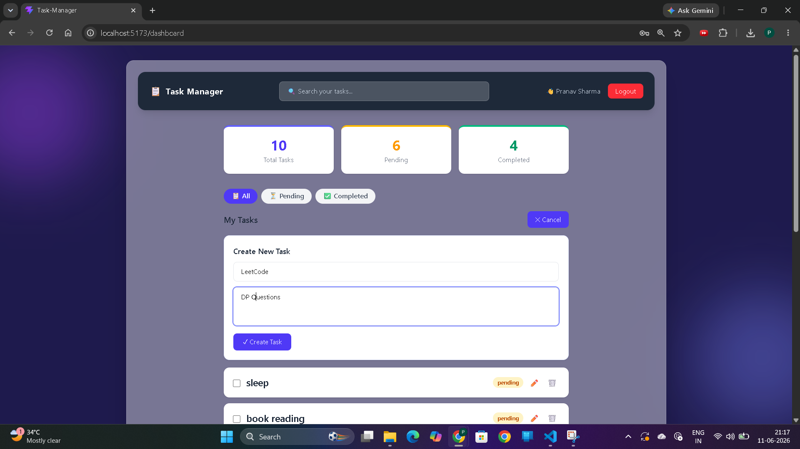
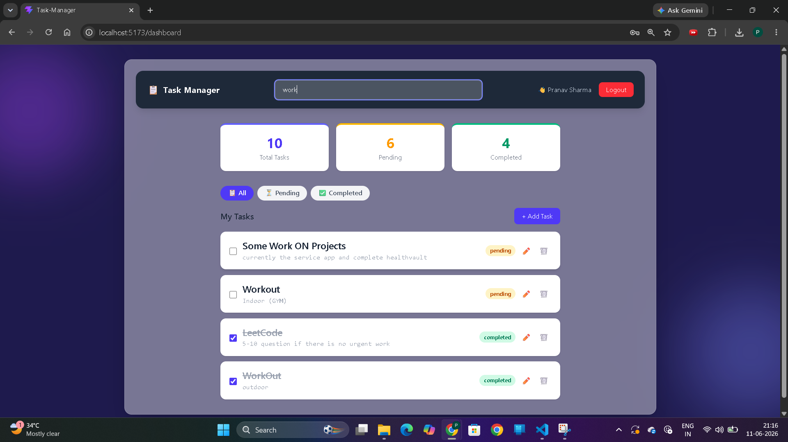
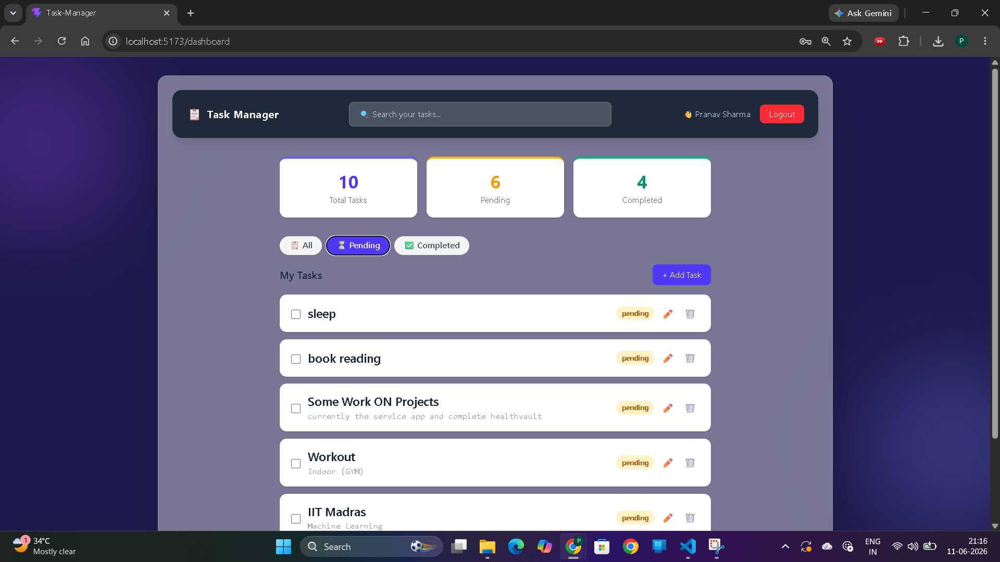
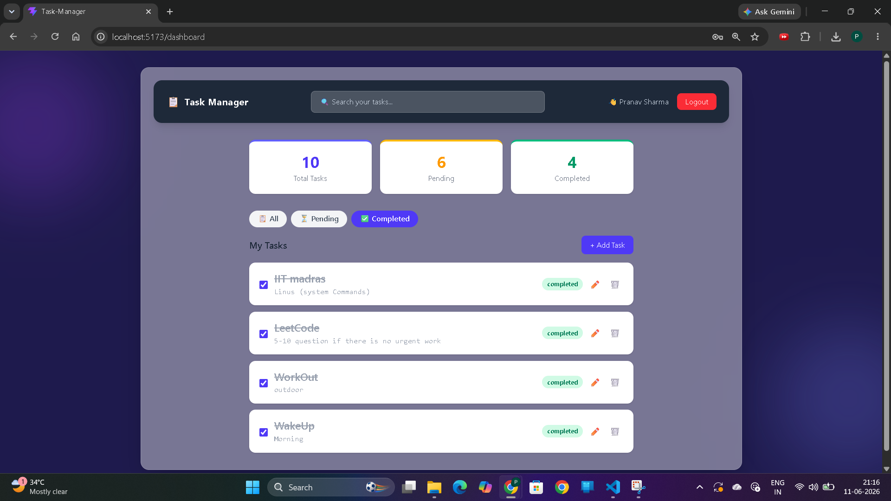

# 📋 Task Manager — MERN Stack

A modern full-stack task management application built using the MERN stack that helps users organize, track, and manage daily tasks efficiently. The application features secure authentication, task tracking, status management, search functionality, and a responsive user interface for seamless productivity.

## 🌐 Live Demo

🔗 **Demo:** https://task-manager-swart-delta.vercel.app/login

## 🚀 Features

- ✅ User Registration & Login with JWT Authentication
- ✅ Create, Read, Update, Delete Tasks
- ✅ Mark tasks as Pending / Completed
- ✅ Protected Routes (Frontend + Backend)
- ✅ Responsive UI with Tailwind CSS
- ✅ Secure Password Hashing with bcryptjs
- ✅ Search & Filter Tasks
- ✅ Persistent User Sessions

## 🛠️ Tech Stack

| Layer | Technology |
|-------|-----------|
| Frontend | React.js, Tailwind CSS |
| Backend | Node.js, Express.js |
| Database | MongoDB Atlas, Mongoose |
| Authentication | JWT, bcryptjs |

## 📁 Project Structure

```text
task-manager/
├── backend/
│   └── src/
│       ├── controllers/
│       ├── models/
│       ├── routes/
│       ├── middleware/
│       ├── db.js
│       └── index.js
└── frontend/
    └── src/
        ├── context/
        ├── pages/
        └── App.jsx
```

## ⚙️ Setup Instructions

### Backend Setup

```bash
cd backend
npm install
```

Create `.env` file:

```env
PORT=5000
MONGO_URI=your_mongodb_connection_string
JWT_SECRET=your_secret_key
```

```bash
npm run dev
```

### Frontend Setup

```bash
cd frontend
npm install
npm run dev
```

## 📸 Screenshots

### Login Page


### Register Page


### Dashboard


### Add Task


### Search Tasks


### Pending Filter


### Completed Filter


## 👨‍💻 Author

**Pranav Sharma**

Full Stack Developer | MERN Stack Developer | BCA Student | BS in Data Science @ IIT Madras

⭐ If you like this project, consider giving it a star.
